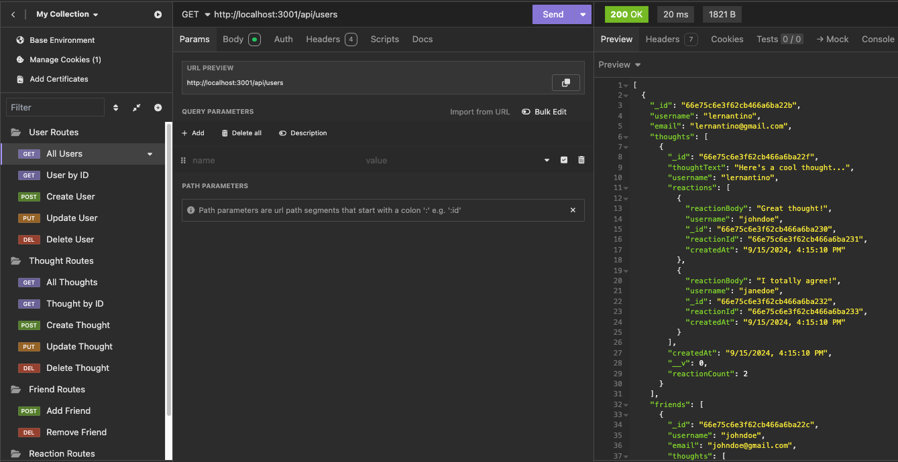
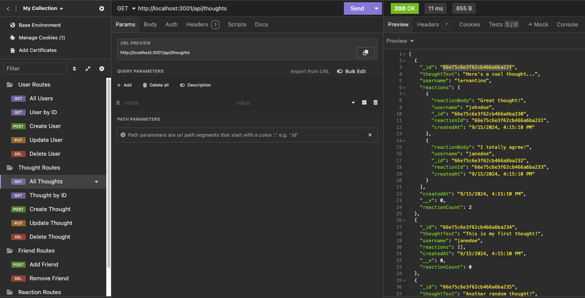
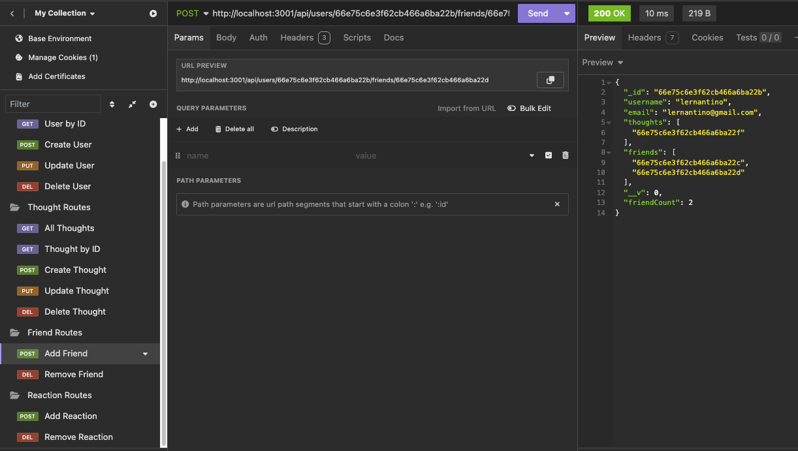
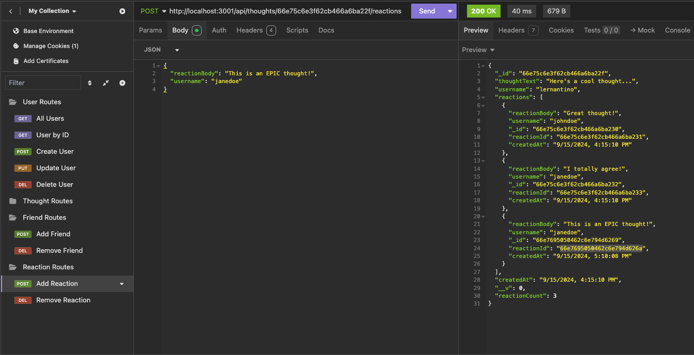

# C18-NoSQL-Social-Network-API

## Project Description

This project is a NoSQL-based Social Network API built using MongoDB, Mongoose, and Express. The API allows for the creation, updating, and deletion of users, thoughts (posts), reactions (comments on posts), and friendships between users. This API is designed to handle data efficiently, making it scalable for social networking platforms. It provides full CRUD operations for users, thoughts, reactions, and friends, leveraging MongoDB’s schema structure.

## Features

- **User Management:**
  - Create, update, and delete users.
  - Add or remove friends to/from a user’s friend list.
  - Automatically update user friend count via a virtual property.
- **Thought Management:**
  - Post, update, and delete thoughts.
  - Attach reactions (replies) to thoughts.
  - Automatically update thought reaction count via a virtual property.
- **Reaction Management:**
  - Add or delete reactions (comments) to specific thoughts.
- **Friendship:**
  - Add or remove friendships between users.
- **NoSQL Integration:**
  - Built with MongoDB and Mongoose to handle unstructured data.

## Usage

To use this API:

1. Clone the repository:
   ```bash
   git clone https://github.com/Lixiviate/C18-NoSQL-Social-Network-API.git
   ```
2. Install dependencies:
   ```bash
   npm install
   ```
3. Seed the database:
   ```bash
   npm run seed
   ```
4. Start the server:
   ```bash
   npm start
   ```
5. Access the API using a tool like Insomnia or Postman.

## API Endpoints

- **Users:**
  - `GET /api/users`: Get all users.
  - `GET /api/users/:userId`: Get a specific user by ID.
  - `POST /api/users`: Create a new user.
  - `PUT /api/users/:userId`: Update a user by ID.
  - `DELETE /api/users/:userId`: Delete a user by ID.
- **Thoughts:**
  - `GET /api/thoughts`: Get all thoughts.
  - `GET /api/thoughts/:thoughtId`: Get a specific thought by ID.
  - `POST /api/thoughts`: Create a new thought.
  - `PUT /api/thoughts/:thoughtId`: Update a thought by ID.
  - `DELETE /api/thoughts/:thoughtId`: Delete a thought by ID.
- **Friends:**
  - `POST /api/users/:userId/friends/:friendId`: Add a friend to a user's friend list.
  - `DELETE /api/users/:userId/friends/:friendId`: Remove a friend from a user's friend list.
- **Reactions:**
  - `POST /api/thoughts/:thoughtId/reactions`: Add a reaction to a thought.
  - `DELETE /api/thoughts/:thoughtId/reactions/:reactionId`: Remove a reaction from a thought.

## Example(s)

[Demo Video]()









## Source Code

- Created by [Lixiviate](https://github.com/Lixiviate)

- Code Assistance:

  - [Mongoose Documentation](https://mongoosejs.com/)
  - [MongoDB Documentation](https://www.mongodb.com/docs/)
  - [MDN Web Docs](https://developer.mozilla.org/en-US/)
  - [W3Schools](https://www.w3schools.com/)
  - [edX Xpert Learning Assistant](https://www.edx.org/)
  - [Stack Overflow](https://stackoverflow.com/)

- Development Resources:

  - [Express.js](https://www.npmjs.com/package/express)
  - [MongoDB](https://www.mongodb.com/)
  - [Mongoose](https://www.npmjs.com/package/mongoose)
  - [Node.js](https://nodejs.org/)

## License

This project is licensed under the MIT license.
